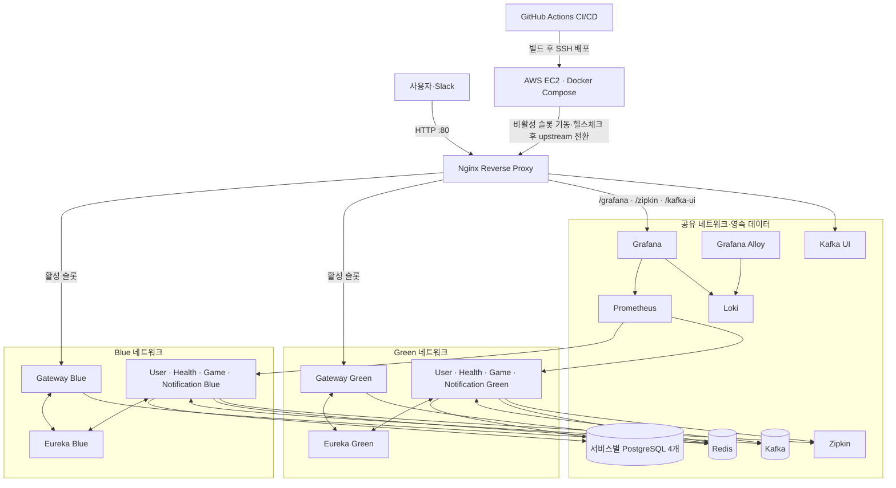
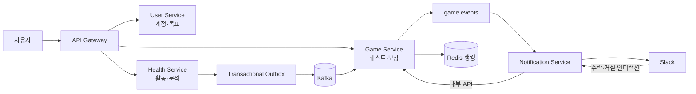

# RPGym

**건강 활동을 퀘스트와 보상으로 연결하는 헬스케어 게이미피케이션 플랫폼**입니다. 건강 데이터를 확인하는 데서 그치지 않고, 목표에 맞춘 퀘스트를 수행하고 XP·캐릭터 성장·파티·랭킹으로 이어지도록 설계했습니다.

## 프로젝트 소개

걸음 수, 활동 시간, 소모 칼로리 등 주기적으로 동기화되는 건강 활동과 사용자가 설정한 일일 목표를 바탕으로 건강 상태와 목표 달성률을 계산합니다. 부족한 활동을 바탕으로 맞춤 퀘스트를 제안하고, 퀘스트 완료 시 경험치와 업적 등 게임 보상을 제공합니다.

```text
건강 활동 동기화 → 목표 달성률 분석 → 맞춤 퀘스트 제안
→ 퀘스트 수행 및 활동 재동기화 → 완료 판정 → XP·성장·업적·랭킹
```

Health Service에는 Health Connect에서 읽은 데이터를 `HEALTH_CONNECT` 출처로 받는 백엔드 수집 경로가 구현되어 있으며, 개발·시연용 Synthetic 수집기도 함께 제공합니다. 두 경로는 동일한 저장·멱등 처리·일일 목표 갱신·이벤트 발행 흐름을 사용합니다. 수집 구조와 요청 규약은 [건강 활동 수집 채널 설계](health-service/docs/activity-ingest.md)를 참고하세요.

## 팀 소개

**2조 오운완**은 서비스 설계부터 구현, 배포와 모니터링까지 함께 진행한 6인 팀입니다.

| 팀원 | 역할 및 담당 |
| --- | --- |
| 정나영 | 팀장 · 개발 리드. 서비스 설계와 개발 방향을 조율하고, 공통 인프라·CI/CD·배포 및 모니터링 환경을 구축했습니다. |
| 최유준 | Game Service 개발. 퀘스트와 게임 서비스의 핵심 기능을 구현했습니다. |
| 남건우 | Game Service 설계·개발. 캐릭터, 랭킹, 파티, 업적 기능을 담당했습니다. |
| 황지호 | User Service와 Notification Service 개발. 사용자 인증, 바디 프로필, 장기·일일 건강 목표 및 Slack 알림을 구현했습니다. |
| 진혜림 | Health Service 개발. 건강 활동 데이터 수집·분석과 건강 목표 달성 현황 처리를 담당했습니다. |
| 강윤석 | Health Service 개발. 건강 활동 및 건강 서비스 기능을 구현했습니다. |

## 주요 기능

- **회원 및 건강 목표**: 회원 인증, 건강 프로필, 장기·일일 건강 목표 관리
- **건강 활동**: 활동 데이터 동기화·조회, 일일 목표 달성률과 부족 지표 분석
- **맞춤 퀘스트**: AI 기반 퀘스트 제안, 퀘스트 수락·진행·완료 처리
- **게임화**: XP, 캐릭터 레벨, 업적, 보상, 개인 및 파티 랭킹
- **파티 플레이**: 파티 생성·참여, 공동 퀘스트와 활동
- **알림**: Slack을 통한 퀘스트 및 파티 알림
- **운영 및 관측**: 메트릭·로그·분산 추적을 위한 모니터링 구성

## 아키텍처

Spring 기반 마이크로서비스로 기능과 데이터 소유권을 분리했습니다. Gateway가 외부 API 요청을 받고, Eureka를 통해 서비스를 탐색합니다. 서비스 간 이벤트는 Kafka로 전달하며, 각 서비스는 PostgreSQL 데이터베이스를 사용합니다.

| 모듈 | 책임 |
| --- | --- |
| `gateway-server` | API 진입점, 라우팅 및 인증 처리 |
| `discovery-server` | Eureka 서비스 등록 및 탐색 |
| `user-service` | 사용자, 프로필, 건강 목표, 인증 |
| `health-service` | 건강 활동 수집·분석, 목표 달성률 및 퀘스트 제안 |
| `game-service` | 퀘스트, 캐릭터, XP, 업적, 보상, 파티, 랭킹 |
| `notification-service` | Slack 알림 및 인터랙션 처리 |
| `common` | 서비스 공통 구성과 라이브러리 |

### 인프라 설계도

운영 배포는 AWS EC2 한 대에서 Docker Compose로 구성하며, Blue-Green 슬롯을 번갈아 배포합니다. 아래는 운영 구성의 주요 연결 관계입니다.



- Nginx는 외부 포트 80을 열고, 앱 트래픽을 활성 Gateway로 전달합니다. 운영용 Grafana·Zipkin·Kafka UI도 경로 기반으로 프록시하며, Zipkin과 Kafka UI는 Basic Auth로 보호합니다.
- Blue와 Green은 각각 Gateway·Eureka·비즈니스 서비스 인스턴스를 두고, 데이터베이스·Kafka·Redis는 두 슬롯이 공유합니다. 서비스별 PostgreSQL 인스턴스와 영속 볼륨으로 데이터를 유지합니다.
- GitHub Actions는 변경된 애플리케이션을 빌드해 EC2의 비활성 슬롯에 배포합니다. 배포 스크립트가 헬스 체크 후 Nginx upstream을 전환하며, 전환 실패 시 기존 슬롯으로 복구합니다.
- Prometheus는 서비스 메트릭을 수집하고 Grafana에서 메트릭·로그 대시보드를 확인합니다. Grafana Alloy는 컨테이너 로그를 Loki로 전달하고, Zipkin은 분산 트레이스를 수집합니다.

개발 환경은 `docker-compose-develop.yml`로 공용 인프라를 로컬에 띄우고 각 애플리케이션 서비스를 Gradle로 실행합니다. 운영 환경의 Blue-Green 구성은 `docker-compose-prod.yml`을 기준으로 합니다.

### 서비스 간 흐름



1. 사용자가 가입하고 건강 프로필과 일일 목표를 설정합니다. 외부 API 요청은 Gateway에서 JWT를 검증한 뒤 해당 서비스로 전달합니다.
2. Health Connect 데이터 동기화 요청 또는 개발용 Synthetic 스케줄러가 걸음 수·활동 시간·활동 칼로리의 당일 누적 스냅샷을 Health Service에 전달합니다. 같은 사용자와 측정 시각의 재전송은 멱등하게 처리합니다.
3. Health Service는 활동과 목표 진행 상황을 저장하고, 데이터 변경 이벤트를 같은 데이터베이스 트랜잭션의 Outbox에 기록합니다. 발행 작업이 Kafka의 `health.events`로 전달하며, 일일 목표 전체 달성 이벤트는 `health.daily-goal.events`로 발행합니다.
4. Game Service는 건강 이벤트를 소비해 최신 스냅샷과 퀘스트 제안을 처리합니다. 진행 중인 퀘스트가 없고 제안이 유효하면 퀘스트를 만들고, 이후 들어오는 누적 활동값과 퀘스트 기준 시점의 baseline을 비교해 진행도와 완료 여부를 계산합니다.
5. Game Service는 퀘스트 제안을 `game.events`로 알립니다. Notification Service가 대상 사용자의 Slack ID를 조회해 DM을 보내고, 수락·거절 버튼 요청을 검증한 뒤 Game Service의 내부 API에 전달합니다.
6. 퀘스트 및 일일 목표 완료는 XP·업적·보상 처리로 이어집니다. XP 변경은 캐릭터 레벨과 Redis 랭킹에 반영되며, 파티 퀘스트는 파티원별 진행 상황과 파티 랭킹에 반영됩니다.

Kafka 소비자는 중복 또는 순서가 뒤바뀐 활동 이벤트를 고려해 측정 시각과 멱등 키를 활용합니다. Outbox 재시도와 멱등 처리를 통해 데이터 저장과 이벤트 발행 사이의 유실 및 중복 보상 위험을 줄입니다.

### 서비스 상세

#### API Gateway (`gateway-server`)

- 외부 API의 단일 진입점이며, Eureka에 등록된 서비스로 경로를 라우팅합니다.
- JWT를 검증하고 요청의 사용자 식별 정보를 서비스에 전달합니다. 서비스별 OpenAPI 문서를 모아 통합 Swagger UI를 제공합니다.
- Actuator 메트릭 포트와 사용자 요청 포트를 분리하고, 요청 타임아웃과 graceful shutdown 설정을 적용합니다.

#### Service Discovery (`discovery-server`)

- Eureka 서버로 각 애플리케이션 인스턴스를 등록하고 서비스 목록을 제공합니다.
- Gateway와 서비스 간 통신은 고정 주소 대신 서비스 이름을 사용해 인스턴스를 찾습니다.

#### User Service (`user-service`)

- 회원가입·로그인과 JWT 발급, 토큰 재발급 회전(RTR), 로그아웃 및 회원 계정을 관리합니다.
- 바디 프로필과 장기·일일 건강 목표를 저장하고 조회합니다.
- Health Service가 목표 달성률을 계산할 때 필요한 사용자 목표 정보를 제공하며, Notification Service에서 사용할 사용자 및 Slack 정보를 제공합니다.

#### Health Service (`health-service`)

- 걸음 수, 활동 시간, 활동 칼로리의 건강 활동을 측정 시각 기준 누적 스냅샷으로 저장하고 오늘의 활동 및 목표 진행 현황을 제공합니다.
- 동기화 API는 `HEALTH_CONNECT`를 외부 수집 채널로 지원하고, 서버 내부 개발·시연용으로 Synthetic 활동 생성기도 제공합니다. 두 입력은 같은 동기화 유스케이스를 거칩니다. 이 저장소는 백엔드이며 Android 앱 구현은 포함하지 않습니다. Samsung Health SDK 직접 연동도 현재 활성화되어 있지 않습니다.
- User Service에서 목표를 조회해 일일 목표 진행률과 미달 항목을 계산하고, Gemini 기반 맞춤 퀘스트 제안을 생성합니다. AI 요청이 실패하면 기본 퀘스트로 폴백합니다.
- 활동 변경 및 일일 목표 완료 이벤트를 Outbox에 기록해 Kafka로 발행합니다. 발행 재시도·오래된 이벤트 정리·발행 지표를 위한 스케줄 작업도 포함합니다.

#### Game Service (`game-service`)

- Health Service의 `health.events`를 소비해 사용자별 최신 활동 스냅샷을 반영하고 퀘스트 제안을 검토합니다.
- 제안 수락 및 퀘스트 생명주기와 진행도를 관리합니다. 퀘스트 기준 시점 이후의 누적 활동 증가량을 측정값으로 사용해 완료를 판정합니다.
- XP 원장과 잔액, 캐릭터 레벨, 업적 및 보상을 관리합니다. 일일 목표 완료 이벤트는 별도 소비자가 처리합니다.
- 개인·친구·파티 랭킹과 파티 생성·초대·매칭·공동 퀘스트를 제공합니다. Redis Sorted Set을 랭킹 조회에 사용합니다.
- `game.events`를 발행해 Notification Service에 개인 퀘스트 제안과 파티 퀘스트 생성 사실을 전달합니다.

#### Notification Service (`notification-service`)

- Game Service 이벤트를 소비해 퀘스트 및 파티 퀘스트 안내를 Slack DM으로 보냅니다.
- Slack 버튼 인터랙션 요청의 서명을 검증하고 제안 수락·거절을 Game Service 내부 API에 전달합니다.
- Slack 발송 상태를 저장해 제안 알림의 중복 처리를 관리합니다.

#### Common (`common`)

- 여러 애플리케이션 모듈이 공유하는 라이브러리와 기반 구성을 둡니다. 각 비즈니스 서비스의 데이터와 규칙은 해당 서비스가 소유합니다.

## 기술 스택

- **언어 및 프레임워크**: Java 17, Spring Boot 3.5, Spring Cloud 2025
- **서비스 통신**: Spring Cloud Gateway, Eureka, OpenFeign
- **데이터 및 메시징**: PostgreSQL 16, Redis 8, Apache Kafka 4.3, Flyway
- **외부 연동**: Google Gemini API, Slack API
- **인프라 및 관측**: Docker Compose, Nginx, Prometheus, Grafana, Loki, Grafana Alloy, Zipkin
- **API 문서**: Springdoc OpenAPI / Swagger UI
- **빌드 및 배포**: Gradle, GitHub Actions, AWS

## 시작하기

### 준비물

- JDK 17
- Docker 및 Docker Compose
- 로컬 서비스 실행에 필요한 환경 변수

### 인프라 실행

저장소 루트에서 환경 변수 파일을 준비하고 로컬 인프라를 실행합니다.

```bash
cp .env.example .env
```

`.env.example`의 데이터베이스, Redis, Kafka, Eureka, JWT 및 연동 설정을 로컬 환경에 맞게 채웁니다. 비밀 키와 토큰은 저장소에 커밋하지 마세요.

```bash
docker compose -f docker-compose-develop.yml up -d
```

이 Compose 파일은 개발용 PostgreSQL 데이터베이스 4개, Kafka 및 Kafka UI, Redis, Prometheus, Grafana, Loki, Grafana Alloy, Zipkin을 실행합니다. 애플리케이션 서비스는 별도로 실행합니다.

### 애플리케이션 실행

각 서비스는 별도의 터미널에서 실행합니다. 의존 서비스가 준비된 뒤 서비스 검색 서버를 먼저 실행하고, Gateway와 비즈니스 서비스를 시작하세요.

```bash
./gradlew :discovery-server:bootRun
./gradlew :gateway-server:bootRun
./gradlew :user-service:bootRun
./gradlew :health-service:bootRun
./gradlew :game-service:bootRun
./gradlew :notification-service:bootRun
```

Windows에서는 `./gradlew` 대신 `gradlew.bat`을 사용할 수 있습니다. 애플리케이션의 필수 환경 변수와 포트는 각 서비스 설정을 확인하세요.

## API 문서 및 개발 자료

- Swagger UI는 Gateway 통합 문서를 포함해 Gateway 실행 후 `http://localhost:19001/swagger-ui.html`에서 확인할 수 있습니다.
- 건강 활동 수집 채널과 `measuredAt`·재전송 규약은 [health-service/docs/activity-ingest.md](health-service/docs/activity-ingest.md)에 정리되어 있습니다.
- API, 데이터 모델, 시스템·인프라 구조 자료는 [팀 프로젝트 노션](https://app.notion.com/p/RPGym-3ccbd90be68380d49b6cf22bee3ae44f)에서 확인할 수 있습니다.
- 원격 저장소: [workout-done/rp-gym](https://github.com/workout-done/rp-gym)
